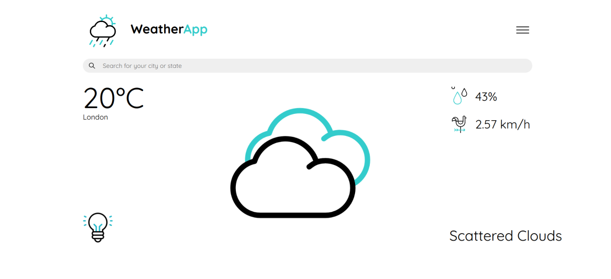
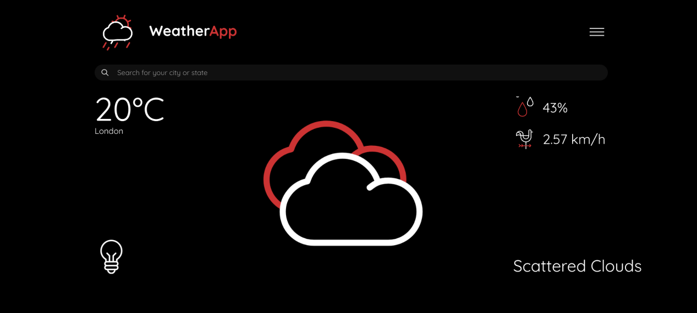

# WeatherApp
This is an app made using JS/HTML5/CSS3 that utilises the OpenWeatherMap API to display the current weather of any place that is requested by the user.

[Click here to check it out!](https://fancy-lily-1e0bf1.netlify.app/)

This also comes with a dark mode for all the night owls ^_^

# Screenshots
## Light Mode

## Dark Mode

# Pending
1. ~~Mobile View
2. (Possibly) Astrology
3. (Possibly) 7-Day Weather Forecast
